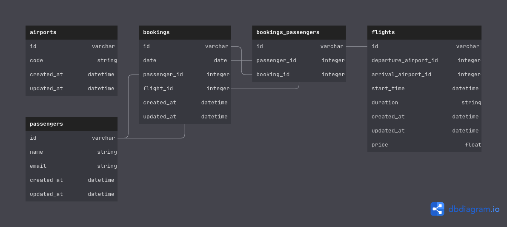

<h1 style="margin-top: 0px;">FlightBooker</h1>

This project involves building of a typical checkout process for booking a one-way flight (a flight that is booked from a passenger’s departure airport to their intended destination airport with no scheduled return trip).

### Overview:

The application focuses on getting more comfortable with Active Record and more advanced rails forms (such as pre-populating data from multiple models through select helpers and usage of nested attributes). Users find flights based on - departure airport, arrival airport and departure date. Once search results are returned, the user just needs to choose from among the available flights. Once the user has submitted their chosen flight, it's time to enter passenger information to finalize their booking. For the purposes of this project, it is not necessary signing up or logging in to use the app.

### Demo:

You can try it out [here](https://enigmatic-refuge-15880.herokuapp.com/).

### Gems used:

- [Tailwindcss](https://tailwindcss.com/) - CSS framework.

- [Faker](https://github.com/faker-ruby/faker) - generates fake data.

- [iso_country_codes](https://github.com/alexrabarts/iso_country_codes) - provides ISO codes, names and currencies for countries.

### Database schema:

### Contributing:

Pull requests are welcome.
